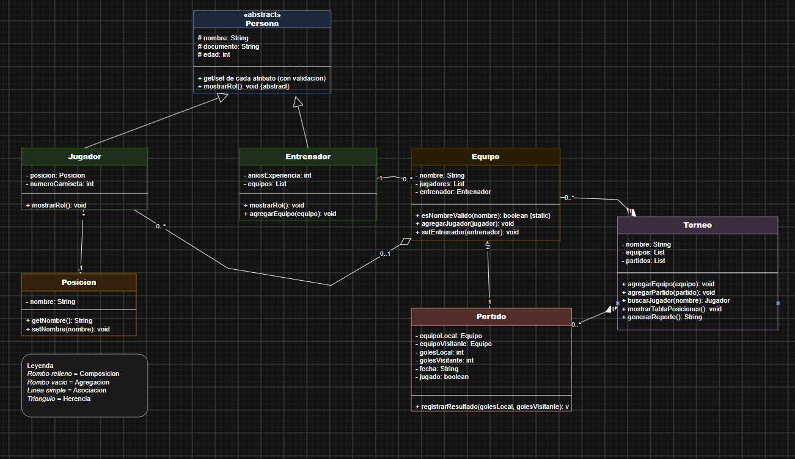

# CrediYa S.A.S. - Sistema de prestamos y cobros

Sistema de **consola en Java** para digitalizar el control de prestamos y cobros de CrediYa S.A.S., empresa que otorga creditos personales y que antes manejaba todo en hojas de calculo.

El programa gestiona **empleados, clientes, prestamos y pagos**, y guarda la informacion en **MySQL (JDBC)** y en **archivos de texto**.

---

## Que hace el sistema

| Modulo | Funciones |
|---|---|
| Empleados | Registrar, listar y buscar por id. Datos: id, nombre, documento, rol, correo, salario |
| Clientes | Registrar, listar y consultar los prestamos de un cliente. Datos: id, nombre, documento, correo, telefono |
| Prestamos | Crear un prestamo asociando cliente y empleado, calcular el **monto total con interes** y la **cuota mensual**, y cambiar el estado (PENDIENTE / PAGADO) |
| Pagos | Registrar abonos, actualizar el **saldo pendiente** y mostrar el historico de pagos de un prestamo |
| Reportes | Prestamos activos, prestamos vencidos, clientes morosos, cartera pendiente, total recaudado, prestamos por empleado, prestamo de mayor monto y prestamos ordenados por saldo (con **Lambda y Stream API**) |

### Formulas

```
total   = monto + (monto * interes / 100)        (el interes es un % sobre el monto, ej: 10 = 10%)
cuota   = total / numero de cuotas
saldo   = total - suma de los pagos
vencido = prestamo PENDIENTE cuya fecha_inicio + cuotas (en meses) ya paso
moroso  = cliente con al menos un prestamo vencido
```

Cuando el saldo de un prestamo llega a 0, el prestamo pasa solo a **PAGADO**.

---

## Estructura del proyecto

```
CrediYa/
├── datos/
│   ├── clientes.txt
│   ├── empleados.txt
│   ├── pagos.txt
│   └── prestamos.txt
├── docs/
│   ├── diagrama proyecto java.drawio
│   └── Diagrama_Drawio.png
├── sql/
│   ├── crediya_db.sql
│   └── datos_ejemplo.sql
├── src/main/java/com/crediya/
│   ├── app/            Main, Menu
│   ├── excepciones/    CrediYaException, ValidacionException,
│   │                   RecursoNoEncontradoException, ArchivoException
│   ├── modelo/         Persona, Empleado, Cliente, Prestamo, Pago,
│   │                   EstadoPrestamo, Exportable
│   ├── persistencia/   ConexionBD, Repositorio, PrestamoRepositorio,
│   │                   EmpleadoDAO, ClienteDAO, PrestamoDAO, PagoDAO, ArchivoTexto
│   ├── servicio/       EmpleadoServicio, ClienteServicio, PrestamoServicio,
│   │                   PagoServicio, ReporteServicio
│   └── util/           Validador
├── .gitignore
├── pom.xml
└── README.md
```

| Paquete | Responsabilidad |
|---|---|
| `app` | Arrancar el programa y mostrar los menus de consola |
| `modelo` | Clases con los datos y sus calculos (herencia y polimorfismo) |
| `servicio` | Validar, aplicar las reglas del negocio y guardar en MySQL y en archivo |
| `persistencia` | Conexion a MySQL, DAOs con JDBC y lectura/escritura de archivos |
| `excepciones` | Excepciones propias con mensajes claros |
| `util` | Validaciones de documento, correo, telefono y numeros |

Flujo de una accion: `Menu -> Servicio -> DAO -> MySQL` (y el servicio tambien escribe el archivo `.txt`).

---

## Diagrama UML



El diagrama editable esta en [`docs/diagrama proyecto java.drawio`](docs/diagrama%20proyecto%20java.drawio) (se abre en https://app.diagrams.net).

---

## Requisitos

- Java 17 o superior
- MySQL (con la base de datos `crediya_db`)
- Maven (opcional, para descargar el driver de MySQL automaticamente)

---

## Como ejecutarlo

1. **Crear la base de datos.** Ejecuta en MySQL el script `sql/crediya_db.sql`. Si quieres datos de prueba (incluye prestamos vencidos y clientes morosos), ejecuta tambien `sql/datos_ejemplo.sql`.

2. **Configurar la conexion.** Abre `src/main/java/com/crediya/persistencia/ConexionBD.java` y cambia `USUARIO` y `CLAVE` por los de tu MySQL. Si tu MySQL no esta en el puerto 3306, cambia tambien la `URL`.

3. **Driver de MySQL.**
   - Con Maven (IntelliJ, Eclipse, NetBeans, VS Code): abre la carpeta como proyecto Maven y el `pom.xml` descarga el driver `mysql-connector-j`.
   - Sin Maven: descarga el jar de `mysql-connector-j` y agregalo a las librerias del proyecto.

4. **Ejecutar.** Corre la clase `com.crediya.app.Main`, o desde la terminal:

   ```
   mvn compile exec:java
   ```

   Ejecutalo siempre desde la carpeta raiz del proyecto para que los archivos se guarden en `datos/`.

Si MySQL esta apagado o la clave es incorrecta, el programa muestra un mensaje y se cierra.

---

## Menus y ejemplo de uso

Menu principal:

```
===== CREDIYA S.A.S. =====
1. Empleados
2. Clientes
3. Prestamos
4. Pagos
5. Reportes
6. Ver archivos de texto
0. Salir
```

Todos los submenus tienen la opcion **0. Volver**. Despues de registrar o consultar algo te quedas en el mismo submenu hasta que elijas volver.

**Ejemplo: crear un prestamo** (opcion 3, luego 1)

```
Id del cliente: 2
Id del empleado: 1
Monto: 1200000
Interes (% sobre el monto): 10
Numero de cuotas (meses): 12
Prestamo creado:
[Prestamo 5] ... Total: $1,320,000.00 | 12 cuotas de $110,000.00 | Saldo: $1,320,000.00 | Estado: PENDIENTE
```

**Ejemplo: registrar un abono** (opcion 4, luego 1)

```
Id del prestamo: 5
Monto del abono: 110000
Abono registrado: [Pago 8] Prestamo:5 | Fecha: ... | Monto: $110,000.00
[Prestamo 5] ... Saldo: $1,210,000.00 | Estado: PENDIENTE
```

**Ejemplo: error controlado**

```
Documento: abc
Error: El documento debe tener solo numeros (entre 5 y 15 digitos).
```

El formato de los numeros (puntos y comas) depende de la configuracion regional del computador.

Con los datos de `sql/datos_ejemplo.sql`, el reporte **Clientes morosos** muestra a Carlos Perez y Maria Gomez.

---

## Archivos de texto

El programa genera y mantiene actualizados cuatro archivos en la carpeta `datos/`. Cada linea es un registro con los campos separados por `;`.

| Archivo | Formato de cada linea |
|---|---|
| `empleados.txt` | `id;nombre;documento;rol;correo;salario` |
| `clientes.txt` | `id;nombre;documento;correo;telefono` |
| `prestamos.txt` | `id;clienteId;empleadoId;monto;interes;cuotas;fechaInicio;estado` |
| `pagos.txt` | `id;prestamoId;fechaPago;monto` |

Se reescriben cada vez que se registra algo, y la opcion 6 del menu principal permite verlos.

---

## Base de datos

Se usa el script base del enunciado sin modificaciones (`sql/crediya_db.sql`): tablas `empleados`, `clientes`, `prestamos` y `pagos`. El saldo no se guarda en una tabla: se calcula sumando los pagos de cada prestamo, asi nunca queda desactualizado.

---

## Como se cumple cada criterio

**Diseno orientado a objetos**
- `Persona` (clase abstracta) es el padre de `Empleado` y `Cliente` (herencia).
- `descripcion()` y `toLinea()` se sobrescriben en cada clase hija (polimorfismo).
- Los atributos son privados y se accede con getters (encapsulamiento).
- `Prestamo` calcula por si mismo su total, cuota, saldo y si esta vencido.

**Colecciones y archivos**
- Los servicios mantienen `List` en memoria cargadas desde MySQL.
- `ArchivoTexto` escribe y lee los archivos `.txt`.

**Persistencia con MySQL (JDBC)**
- Un DAO por tabla con `PreparedStatement` (evita inyeccion SQL) y `try-with-resources`.
- Los ids los genera MySQL con `AUTO_INCREMENT` y se leen con `getGeneratedKeys()`.

**Excepciones y validaciones**
- Jerarquia propia: `CrediYaException` -> `ValidacionException`, `RecursoNoEncontradoException`, `ArchivoException`.
- `Validador` revisa campos vacios, documento, correo, telefono, numeros positivos y documentos repetidos.
- El menu captura todos los errores y el programa no se cae.

**Patrones, SOLID y buenas practicas**
- *Singleton*: `ConexionBD`. *DAO / Repositorio*: `Repositorio<T>` y los DAOs. *Capa de servicios*: separa la logica del menu.
- **S**: cada clase tiene una sola tarea (menu, logica, acceso a datos, validacion).
- **O**: se puede agregar otro repositorio sin modificar los servicios.
- **L**: `Empleado` y `Cliente` se usan donde se espera una `Persona`.
- **I**: interfaces pequenas (`Exportable`, `Repositorio`, `PrestamoRepositorio`).
- **D**: los servicios reciben un `Repositorio` por el constructor (inyeccion de dependencias en `Main`).

**Reportes con Lambda y Stream API**
- `ReporteServicio` usa `filter`, `map`, `collect`, `groupingBy`, `mapToDouble`, `sorted` y `max`.
- Los servicios tambien usan streams en las busquedas por id y en la validacion de documentos repetidos.

---

## Subir el proyecto a GitHub

```
git init
git add .
git commit -m "Sistema CrediYa"
git branch -M main
git remote add origin https://github.com/TU_USUARIO/crediya.git
git push -u origin main
```
